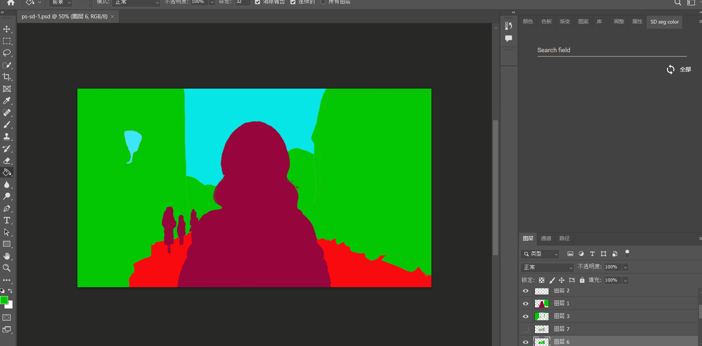

# stable-diffusion-segment-color-search-photoshop-CEP
## 简介 Introduction
> 这是一个简单的Photoshop CEP插件项目，该项目的主要目标是方便用户在绘制语义分割图时，快速的搜索目标类型对应的颜色，并且很方便的将前景色设置成对应的颜色。插件内置的颜色和类别对照表是基于ADE20K的。支持中文和英文搜索。制作这个插件的最初针对的对象是希望使用语义分割图控制Stable Diffusion生成图像的用户。
> 
> This is a simple Photoshop CEP plugin project. The main goal of this project is to help users quickly search for the colors corresponding to the target types when drawing semantic segmentation maps, and easily set the foreground color to the corresponding color. The plugin has a built-in color and category correspondence table based on ADE20K. It supports Chinese and English search. The original target audience of this plugin are users who want to use semantic segmentation maps to control Stable Diffusion to generate images.

## 如何使用？ How to use?

> 将项目中的`com.stable-diffusion-seg-color-search.prod`文件夹复制到Photoshop安装目录下的`Required\CEP\extensions`文件夹中。
> 
> Copy the `com.stable-diffusion-seg-color-search.prod` folder from the project to the `Required\CEP\extensions` folder under the Photoshop installation directory.

